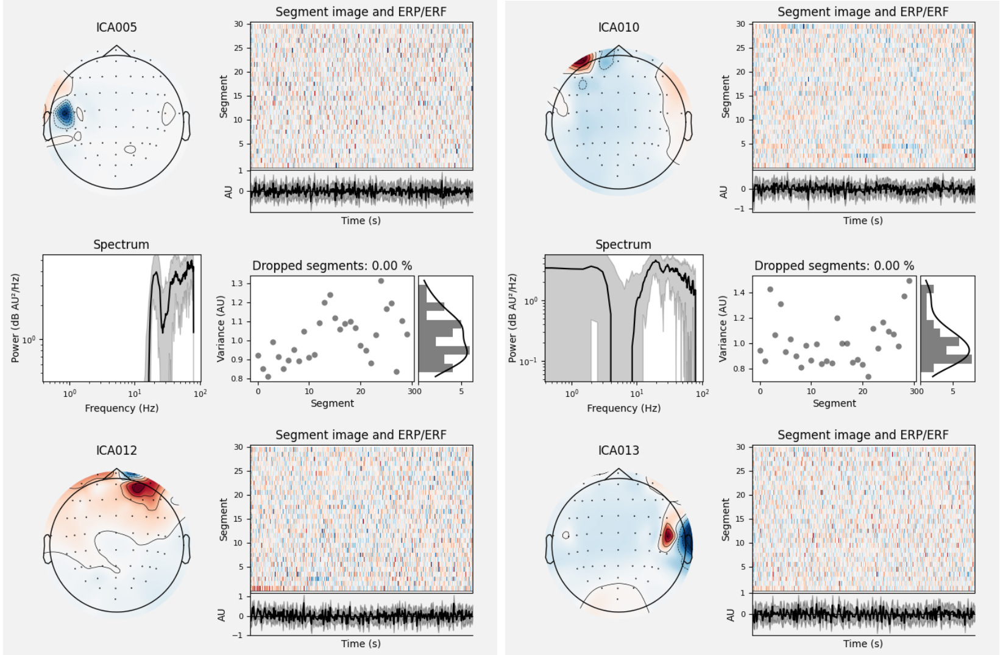

# 脑电数据预处理---念通智能设备版
（持续更新中......）

自行整理python-mne的脑电数据预处理流程，欢迎随时讨论交流

代码针对念通智能64导脑电设备采集得到的脑电信号bdf文件，其他设备见后续文件

代码中使用mne包进行处理，官网：https://mne.tools/stable/documentation/index.html

## 环境搭建

pycharm+anaconda 预处理代码需要使用jupyter notebook，因此pycharm需要下载专业版（非学生付费），因此可选择

【vscode+anaconda+jupyter】
前三步安装： https://blog.csdn.net/weixin_63470844/article/details/142186917?ops_request_misc=%257B%2522request%255Fid%2522%253A%25222ff5c71c4bcf14f5213437a42facacea%2522%252C%2522scm%2522%253A%252220140713.130102334.pc%255Fall.%2522%257D&request_id=2ff5c71c4bcf14f5213437a42facacea&biz_id=0&utm_medium=distribute.pc_search_result.none-task-blog-2~all~first_rank_ecpm_v1~rank_v31_ecpm-2-142186917-null-null.142^v102^pc_search_result_base8&utm_term=vscode%2Bjupter%2Banaconda&spm=1018.2226.3001.4187   
+ 【pycharm+anaconda中教程三创建环境】
+ 在vscode中配置环境
+ https://blog.csdn.net/weixin_54383080/article/details/138613865?ops_request_misc=%257B%2522request%255Fid%2522%253A%252279c61edae3c00d10574097c2ba04482b%2522%252C%2522scm%2522%253A%252220140713.130102334..%2522%257D&request_id=79c61edae3c00d10574097c2ba04482b&biz_id=0&utm_medium=distribute.pc_search_result.none-task-blog-2~all~sobaiduend~default-2-138613865-null-null.142^v102^pc_search_result_base8&utm_term=vscode%20conda%E7%8E%AF%E5%A2%83&spm=1018.2226.3001.4187 

本代码使用【pycharm+anaconda 】，环境搭建如下：

参考教程（按照教程中（一）（二）的内容完成）：

https://blog.csdn.net/lanbo_ai/article/details/142362749?ops_request_misc=%257B%2522request%255Fid%2522%253A%25224e0a81fefe9ae0122dfdcacaec085950%2522%252C%2522scm%2522%253A%252220140713.130102334..%2522%257D&request_id=4e0a81fefe9ae0122dfdcacaec085950&biz_id=0&utm_medium=distribute.pc_search_result.none-task-blog-2~all~sobaiduend~default-4-142362749-null-null.142^v102^pc_search_result_base8&utm_term=pycharm%2Banaconda&spm=1018.2226.3001.4187

教程中（三）：虚拟环境搭建

创建环境（环境名：eeg，python版本为3.11）

```
conda create -n eeg python=3.11 -y
```

进入新创建的环境eeg

```
conda activate eeg
```

安装mne（脑电处理包、交互可视化界面包）

```
pip install mne
# 这两句分别输入
pip install pyqt 
```

之后依旧参照教程中的内容进行，新建项目 加载eeg环境

## 代码和数据导入

建议在新建工程文件夹下再新建两个文件夹code和data分别存放代码和脑电数据


将preprocess.py和analysis.py代码文件放置在code文件夹里

## preprocess代码解析

脑电的预处理过程并非代码全自动进行，仍需实验人员对处理过程的准确性进行把关，因为代码使用jupter notebook的方式运行，每一块代码顺序运行

### 导入包

```python
# 导入包
import numpy as np
import mne
import os
from mne.preprocessing import ICA
import matplotlib.pyplot as plt
%matplotlib qt 
```

### 脑电数据导入

```python
input_data_path = r"D:\Documents\EEG\standard-EEG\data\静息3min_20250408095252.bdf"  # 修改：脑电数据位置
raw = mne.io.read_raw_bdf(input_data_path, preload=True)  # EEG为读入进来的脑电数据
```

按照数据的格式修改对应的read_raw_bdf，mne支持多种脑电格式

- [`read_raw_ant`](https://mne.tools/stable/generated/mne.io.read_raw_ant.html#mne.io.read_raw_ant)
- [`read_raw_artemis123`](https://mne.tools/stable/generated/mne.io.read_raw_artemis123.html#mne.io.read_raw_artemis123)
- [`read_raw_bdf`](https://mne.tools/stable/generated/mne.io.read_raw_bdf.html#mne.io.read_raw_bdf)
- [`read_raw_boxy`](https://mne.tools/stable/generated/mne.io.read_raw_boxy.html#mne.io.read_raw_boxy)
- [`read_raw_brainvision`](https://mne.tools/stable/generated/mne.io.read_raw_brainvision.html#mne.io.read_raw_brainvision)
- [`read_raw_cnt`](https://mne.tools/stable/generated/mne.io.read_raw_cnt.html#mne.io.read_raw_cnt)
- [`read_raw_ctf`](https://mne.tools/stable/generated/mne.io.read_raw_ctf.html#mne.io.read_raw_ctf)
- [`read_raw_curry`](https://mne.tools/stable/generated/mne.io.read_raw_curry.html#mne.io.read_raw_curry)
- [`read_raw_edf`](https://mne.tools/stable/generated/mne.io.read_raw_edf.html#mne.io.read_raw_edf)
- [`read_raw_eeglab`](https://mne.tools/stable/generated/mne.io.read_raw_eeglab.html#mne.io.read_raw_eeglab)
- [`read_raw_egi`](https://mne.tools/stable/generated/mne.io.read_raw_egi.html#mne.io.read_raw_egi)
- [`read_raw_eximia`](https://mne.tools/stable/generated/mne.io.read_raw_eximia.html#mne.io.read_raw_eximia)
- [`read_raw_eyelink`](https://mne.tools/stable/generated/mne.io.read_raw_eyelink.html#mne.io.read_raw_eyelink)
- [`read_raw_fieldtrip`](https://mne.tools/stable/generated/mne.io.read_raw_fieldtrip.html#mne.io.read_raw_fieldtrip)
- [`read_raw_fif`](https://mne.tools/stable/generated/mne.io.read_raw_fif.html#mne.io.read_raw_fif)
- [`read_raw_fil`](https://mne.tools/stable/generated/mne.io.read_raw_fil.html#mne.io.read_raw_fil)
- [`read_raw_gdf`](https://mne.tools/stable/generated/mne.io.read_raw_gdf.html#mne.io.read_raw_gdf)
- [`read_raw_kit`](https://mne.tools/stable/generated/mne.io.read_raw_kit.html#mne.io.read_raw_kit)
- [`read_raw_nedf`](https://mne.tools/stable/generated/mne.io.read_raw_nedf.html#mne.io.read_raw_nedf)
- [`read_raw_nicolet`](https://mne.tools/stable/generated/mne.io.read_raw_nicolet.html#mne.io.read_raw_nicolet)
- [`read_raw_nihon`](https://mne.tools/stable/generated/mne.io.read_raw_nihon.html#mne.io.read_raw_nihon)
- [`read_raw_nirx`](https://mne.tools/stable/generated/mne.io.read_raw_nirx.html#mne.io.read_raw_nirx)
- [`read_raw_nsx`](https://mne.tools/stable/generated/mne.io.read_raw_nsx.html#mne.io.read_raw_nsx)
- [`read_raw_persyst`](https://mne.tools/stable/generated/mne.io.read_raw_persyst.html#mne.io.read_raw_persyst)
- [`read_raw_snirf`](https://mne.tools/stable/generated/mne.io.read_raw_snirf.html#mne.io.read_raw_snirf)

### 对脑电数据的电极位置进行定位

```python
channel_montage = mne.channels.read_custom_montage(r"D:\Documents\EEG\ERP analysis\standard_1005.elc")  # 修改： .elc为电极定位文件（念通智能64导），需根据实际情况修改该文件位置
raw.drop_channels(['I0'])  # 去除眼睛下方的电极
raw.set_montage(channel_montage)  # 将电极位置坐标赋予脑电数据各通道
raw.plot_sensors(kind='topomap', show_names=True)  # 查看电极位置（可注释）
```

代码最后一句一般仅在第一次载入电极定位文件时使用，用于查看位置是否正确，之后可注释掉该句

#### 查看脑电数据并先删除实验开始前后不稳定的数据

在实验最开始记录时，以及快要结束时，往往会因为被试移动等多种因素导致数据不稳定，同时这两段脑电数据并非实验需要，因此将其截取掉，只保留中间的数据

```python
fig = raw.plot(block=True)  # 可视化脑电信号
# --------------分割线----------------（分为两个代码块运行）
EEG = raw.copy().crop(tmin=11.314, tmax=raw.times[-1])  # 修改：脑电数据截取时段
fig_after = EEG.plot(block=True)  # 可视化脑电信号
```

首先查看输入的脑电数据，可视化的界面中鼠标点击数据背景可放置垂直指示线，显示当前时间点，记录需要保留的中间段开始时刻，再放置垂直指示线至数据后段记录需要保留的中间段结束时刻，对应修改tmin和tmax，示例中保留从11.314s到数据结束这一时段的数据

代码最后一句再次查看截取后保留的脑电数据，做进一步检查

弹出的可视化交互界面中，可进行的操作如下


### 滤波

```python
EEG.notch_filter(50)  # 陷波滤波，去除工频干扰50Hz
EEG.filter(l_freq=0.1, h_freq=None)  # 修改：高通滤波，保留大于0.1Hz的波
EEG.filter(l_freq=None, h_freq=100)  # 修改：低通滤波，保留小于100Hz的波
```

去除工频干扰并将脑电信号滤波至0.1-100Hz（自行设置）


### 剔除坏电极

```python
bad_channels = mne.preprocessing.find_bad_channels_lof(EEG, threshold=2)  # 设置threshold，超参数，数值越小越严格
# ------- 分割线 -------（先运行第一个代码块，可从输出界面查看坏导，并根据要求对应修改阈值）
EEG.info['bads'] = bad_channels
EEG = EEG.interpolate_bads(reset_bads=True)  # 插值坏导
```

采用局部离群因子算法自动识别坏电极，如果一个通道的统计特征在附近通道中格格不入就会被标为离群值，threshold是离群值阈值，大于1表即开始离群，mne默认阈值设置为1.5，数值越小越严格，这个值是一个超参数，自行设置

识别得到坏导后进行插值得到新的数据


### 降采样

```python
EEG.resample(sfreq=500)  # 降采样500HZ
```

可选，不需要降采样可注释该句


### 重参考

一般将重参考设置为双侧乳突的均值、全局平均参考、零电位参考，在原参考未被记录的情况下，可用前两种参考方法，当原参考电极数值可恢复时，三种方法均可使用，并建议使用零电位参考

念通智能设备使用的参考电极为FCz，位于头顶，且参考电极数据未被记录，将其重参考至双侧乳突的均值或进行全局平均参考，首先需要查看双侧乳突电极的数据质量，如果数据质量较差且电极通道数>=64，使用平均参考；质量较好时依据电极通道数进行选择，电极数<32不要使用平均参考

```python
fig = EEG.plot(block=True)
EEG.set_eeg_reference(ref_channels='average')  # 修改：ref_channels
```

```python
EEG.set_eeg_reference(ref_channels=['TP9', 'TP10'])   # 采用双侧乳突平均值时 
EEG.set_eeg_reference(ref_channels='REST')  # 采用零电位参考时 
```


### 去伪迹 ICA

首先，ICA分解为n个成分，此处设置为30，ICA函数的运行逻辑是先将数据PCA降维后再进行ICA分解，为了ICA算法的稳定性和收敛性，设置其成分数一般为15-30；

```python
ica = ICA(n_components=30,  max_iter='auto')
ica.fit(EEG)
ica.plot_sources(EEG, show=True)
ica.plot_components()
```

得到两类图，源+成分，从两种图手动观察眼电、肌电、心电

初步判断：

肌电成分：17、21


肌电成分的主要特征参见mne：https://mne.tools/stable/auto_examples/preprocessing/muscle_ica.html    成分波形为很密集的棘波，地形图主要集中在颞叶区/某一个位置




眼电成分：1、6

以下两种均为比较典型的眼电成分，两类眼电成分也有可能以红蓝颜色互换的形式呈现


心电成分：参见https://mne.tools/stable/auto_tutorials/preprocessing/40_artifact_correction_ica.html


使用算法自动寻找肌电伪迹，mne所采取的判断方法如下，再得到算法判断的成分之后，结合实验人员的判断综合考虑（需要实验人员double check，不能全部依赖算法实现）


算法同时输出每一个成分判断为肌电的得分

```python
muscle_idx_auto, scores = ica.find_bads_muscle(EEG)
ica.plot_scores(scores, exclude=muscle_idx_auto)  # 输出每一个成分被判断为肌电的分数
print(f"Automatically found muscle artifact ICA components: {muscle_idx_auto}") # 输出肌电伪迹的成分号
```

```python
# 再次查看综合考虑后所判断的肌电成分，进行查看，这一步可以不进行
ica.plot_properties(raw, picks=[17, 19])  # 结合自行判断+程序判断，查看对应的肌电成分
```

使用算法自动寻找眼电、心电伪迹时，需要匹配眼电、心电通道的数据，但是实验采用的设备基本上都是仅脑电，因此可以设置一个伪眼电，即ch_name设置为靠近眼睛的某一电极；无法设置伪心电，因此需要实验人员判断

```python
eog_indices, eog_scores = ica.find_bads_eog(EEG, ch_name='Fpz')  # 设置伪眼电通道 ‘FPz’
print(f"Automatically found eye artifact ICA components: {eog_indices}")
```

程序自动判断出的眼电成分同样与实验人员判断出的眼电进行综合考虑，毕竟此处设置的‘FPz’是伪眼电

将最终判断得到的肌电、眼电、心电成分剔除

```python
# 剔除肌电、眼电、心电成分
ica.exclude = [1, 6, 17, 19]
ica.apply(EEG)
EEG.plot(show=True)  # 查看去伪迹后的数据，可注释
```

保存预处理后的脑电信号

```python
# 输出预处理后的脑电信号
output_data_path = r"D:\Documents\EEG\standard-EEG\data\preocessed_eeg.fif"
EEG.save(output_data_path)
```

指定输出路径，保存fif格式

备注：没有进行分段和坏段剔除，坏段剔除待后续更新（可能会放置在ICA之前）
